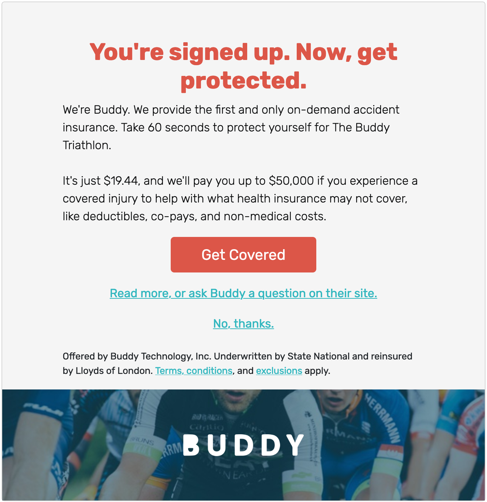
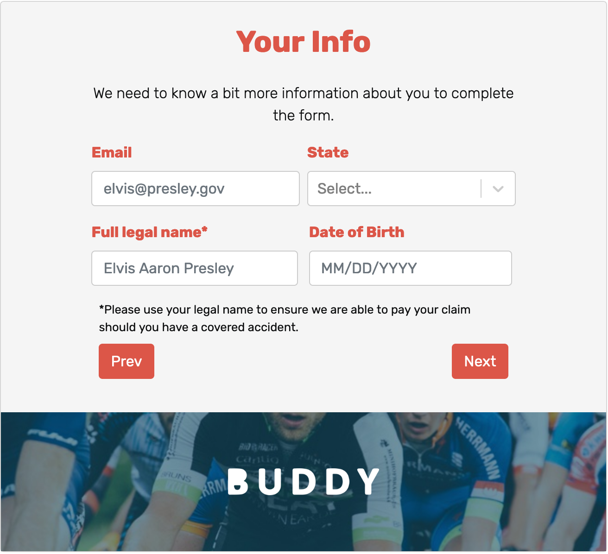
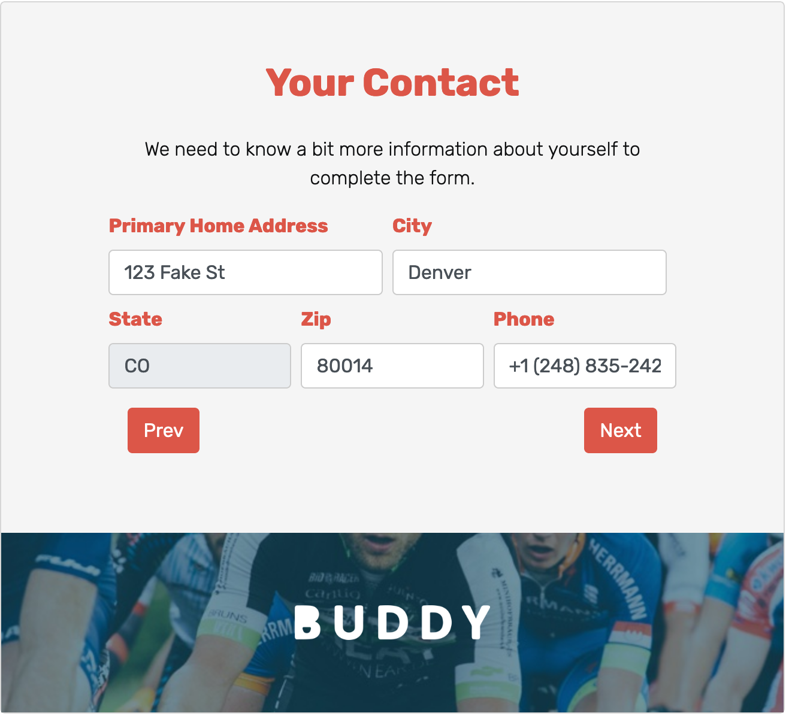
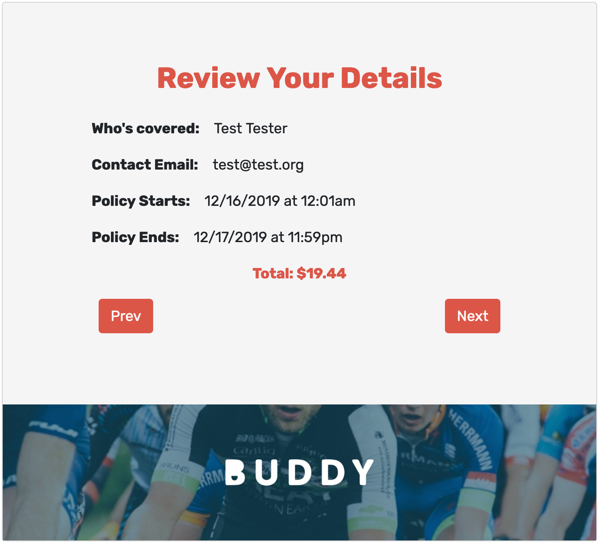
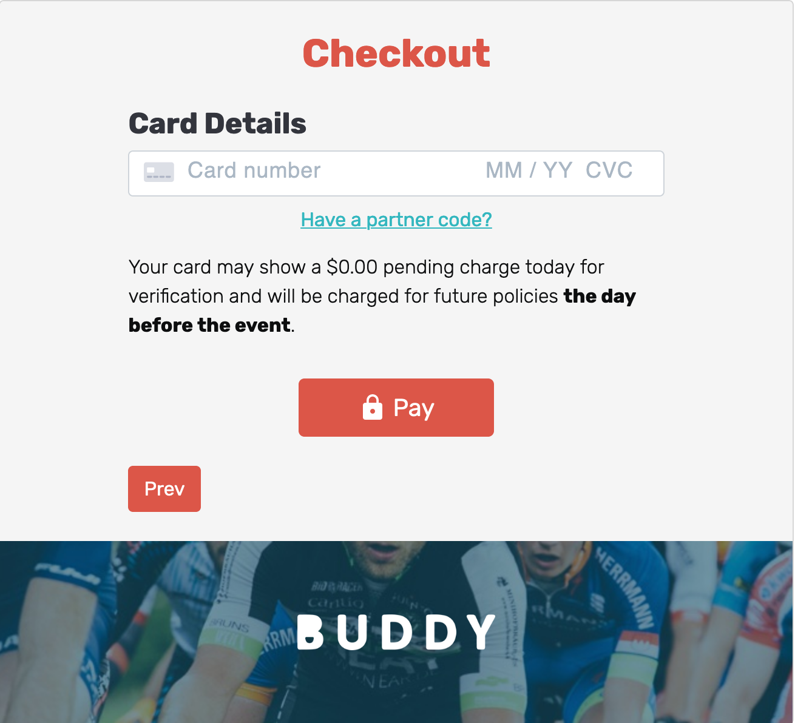

# Buddy Iframe Widget

Dev resources a little jammed up? We get it! The Buddy iFrame Widget is a great starting point while the [API](https://buddyinsurance.com/api) integration is being scoped. 

The Buddy iFrame Widget is one line of code that can be inserted within your website/platform in a matter of minutes. If you have any questions, please reach out to: cezar@iambuddy.com.

---

### How it works:

1. Pick a location on your website/platform for the Buddy iFrame Widget. We recommend the confirmation/receipt page. 
2. Insert the iframe within the source code. EXAMPLE: 
```html
<iframe style="border: none;"src="https://widget.buddyinsurance.com/?type=iframe&series=12/07/2019-12/08/2019&seriesName=Buddy%20Race&seriesType=Race&isCompeting=true" width="100%" height="1000" frameborder="0"></iframe>
```
3. Customers complete the Buddy insurance purchase in 5 easy steps within the widget, without being redirected to any other pages. 
4. Your company earns ancillary revenue immediately! 

Example customer experience flow:

**Step 1 - Offer**



**Step 2 - Enter Info**



**Step 3 - Enter Contact Info**



**Step 4 - Review**



**Step 5 - Checkout**



### Basic example:

```javascript
    // set up data to send to iframe
    var dates='12/27/2019,12/31/2019' // required
    var eventName='Zip Line'
    var eventType='Zip lining'
    var activities='zip lining, ropes course';
    var DOB='01/01/2000'
    var email='cezar@iambuddy.com'
    var name='Cezar Carvalhaes'
    var competition=true;
    var buddyURl='https://widget.buddyinsurance.com/';
    var partner='Sunrise'
    var params=`?type=iframe&series=${dates}&seriesName=${eventName}&seriesType=${eventType}&isCompeting=${competition}&dob=${DOB}&activities=${activities}&name=${name}&email=${email}&partner=${partner}`
    
    // create iframe
    var buddyFrame = document.createElement('iframe');
    buddyFrame.src=buddyURl + params;
    buddyFrame.width='100%';
    buddyFrame.height='1000';
    buddyFrame.frameBorder='0';

    document.body.appendChild(buddyFrame);
```

### Query Params
List of all possible query params. The more info is passed, the better the user experience.

| Name | format | Description | Required |
| --- | ---| --- | ---|
| series | MM/DD/YYYY | Date(s) of the event. Mutiple dates separated by `,` or `-` for range | Yes |
| eventName | text | Name of event or activity | No |
| eventType | text | Type of event or activity (ie. Race, Tournament, etc) | No |
| activities | activity,activity.... | Activities. Separated by a comma. | No |
| dob | MM/DD/YYYY | Customer Date of birth | No |
| email | email | Customer email | No |
| name | FirstName LastName | ie: 'John Smith' | No |
| isCompeting | boolean | Does the activity require competition coverage? | No |
| address1 | text | Customer Street address | No |
| address2 | text | Customer Line 2 of street address | No |
| city | text | Customer city | No |
| state | text | Customer state, as two letter abbreviation (AL, AK, AZ...) | No |
| zip | text | Customer postal code | No |
| phone | +1 222-2222 | Customer's phone | No |
| partner | text | Partner name | Yes |
